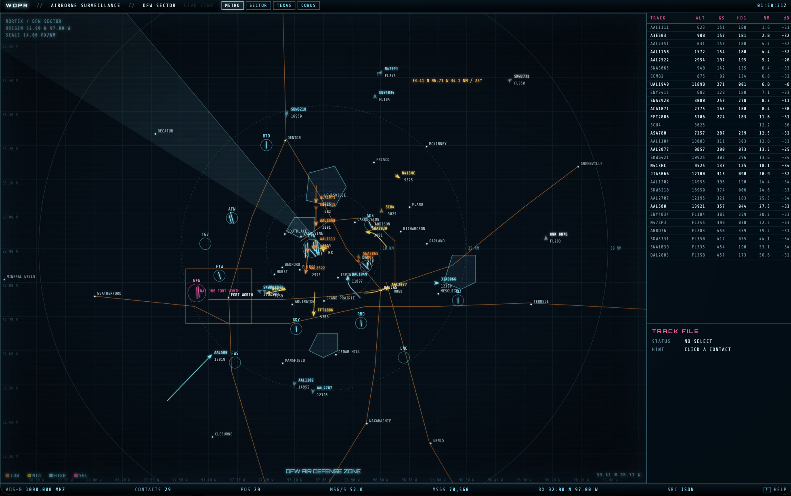

# Wargames ADS-B


Listen to aircraft, and draw them the way NORAD looked in *WarGames*.

This is a local ADS-B console: an RTL-SDR on **1090 MHz** feeds `dump1090-fa`, and a browser UI plots the tracks on a cyan vector map (range rings, phosphor trails, a CRT track file). No cloud, no FlightAware account, no map tiles. The decoder talks to the dongle directly — CubicSDR / GQRX and friends have to **release the USB device** first.

Default map origin is the DFW metro (`32.9 N, 97.0 W`). Change it in `wargames/config.json`.



## Intent

ADS-B is how airliners broadcast GPS position, altitude, callsign, and heading in the clear. A cheap software-defined radio can hear that downlink. The usual next step is a web map that looks like every other web map. This project is the other next step: a single-purpose scope that feels like a 1983 air-defense display, driven by live Mode S.

It is a hobby receiver, not an operational ATC system.

## What you need

| Piece | What this project was built with |
| --- | --- |
| Radio | Generic **RTL-SDR** dongle — Realtek **RTL2832U** ADC, Rafael Micro **R820T** tuner |
| Antenna | Stock telescoping whip that ships with the dongle (fine for nearby arrivals). A small outdoor **1090 MHz** antenna will pull in far more, especially high-altitude heavies. |
| Decoder | [dump1090-fa](https://github.com/flightaware/dump1090) **11.1** via Homebrew (`brew install dump1090-fa`) |
| RTL library | **librtlsdr 2.0.3** (Homebrew `librtlsdr` / `rtl-sdr`) |
| Host | **macOS 26.6.2**, Apple Silicon, Homebrew |
| UI server | **Python 3** (stdlib only — no pip packages). Developed on 3.14. |

Any other process that has claimed the dongle (CubicSDR, GQRX, `rtl_tcp`, another dump1090) must quit first. dump1090 needs exclusive USB access.

## Run

```bash
# live radio + CRT map (starts dump1090 if port 30003 is free)
./start.sh

# attach the map to dump1090 you already have running
./start.sh --ui

# no radio — simulated DFW traffic
./start.sh --demo
```

Then open [http://127.0.0.1:8090/](http://127.0.0.1:8090/).

The UI listens on `0.0.0.0:8090`, so it is also reachable over **Tailscale** at `http://<this-device-tailscale-ip>:8090/` (`tailscale ip -4`). dump1090 stays local; only the map port needs to be reachable. If macOS Firewall prompts, allow incoming for Python.

If you already like the terminal table:

```bash
dump1090 --interactive --net --lat 32.9 --lon -97.0
```

Leave that running and use `./start.sh --ui` for the map.

dump1090 network ports (defaults):

| Port | Protocol |
| --- | --- |
| 30003 | SBS / BaseStation |
| 30005 | Beast |
| 30002 | raw AVR |

The console prefers dump1090’s `--write-json` `aircraft.json` (RSSI, stats). If only `--net` is up, it falls back to SBS on 30003.

## Scope controls

| Key | Action |
| --- | --- |
| drag / arrows | pan |
| wheel | zoom |
| click | select track |
| `1` `2` `3` `4` | metro / sector / texas / conus |
| `F` | follow selected |
| `R` | reset to origin |
| `G` `L` `S` | grid / spikes / sweep |
| `?` | command overlay |

Live mode says **LIVE LINK**. With no radio it says **SIMULATION**.

## Layout

```
start.sh                 launcher
wargames/server.py       dump1090 JSON + SBS → SSE, plus demo sim
wargames/config.json     lat / lon / port / sector title
wargames/public/         CRT UI (canvas vector map)
wargames/run/            dump1090 JSON (created at runtime, not committed)
```

## Notes

- **Space Sector** (`5`) is a world map centered on the receiver. ISS, CSS, Hubble, and NOAA-19 are plotted from **NORAD TLEs** (Celestrak), with AOS/LOS relative to the SDR site. The dongle stays on 1090 MHz ADS-B — it does not retune to VHF satellite downlinks. Aircraft the radio is hearing still appear on that map.
- Frequency is **1090.000 MHz** ADS-B / Mode S. This UI does not decode UAT (978 MHz).
- **UAS** contacts are ADS-B emitter category **B6** (UAV), plus callsigns containing UAS/UAV/DRONE. They draw as a green quadcopter mark. FAA Remote ID over Bluetooth/WiFi is a different radio and is not received by dump1090.
- Gain, PPM correction, and adaptive-gain flags are dump1090’s problem — pass them when you start dump1090 yourself, or edit `start.sh`.
- Fonts in `wargames/public/fonts/` are [Share Tech Mono](https://fonts.google.com/specimen/Share+Tech+Mono) and [Orbitron](https://fonts.google.com/specimen/Orbitron) (SIL Open Font License).
